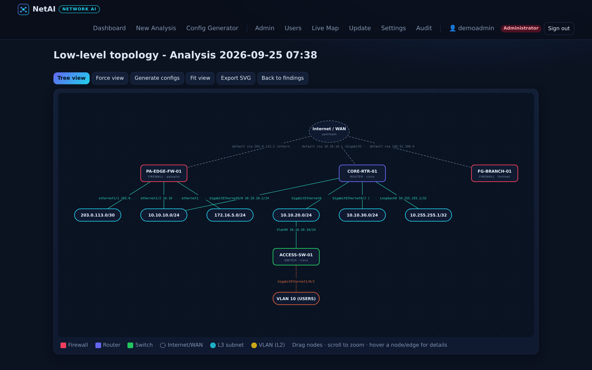
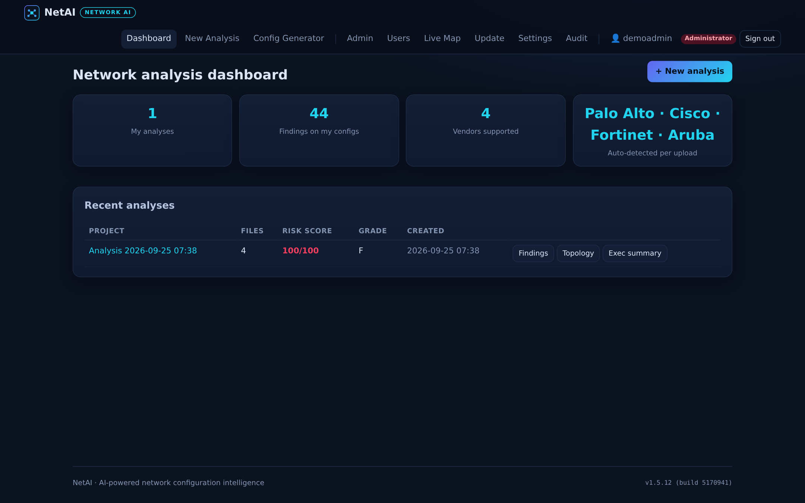
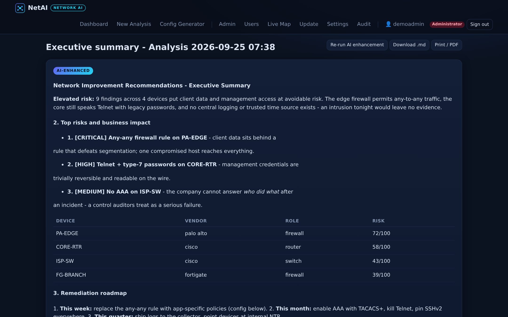
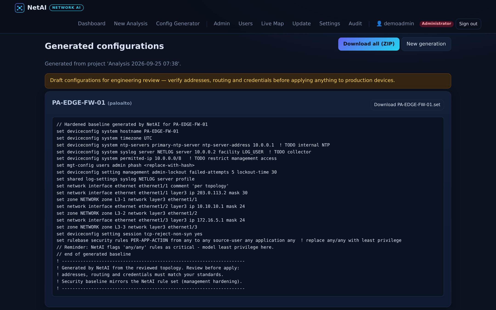
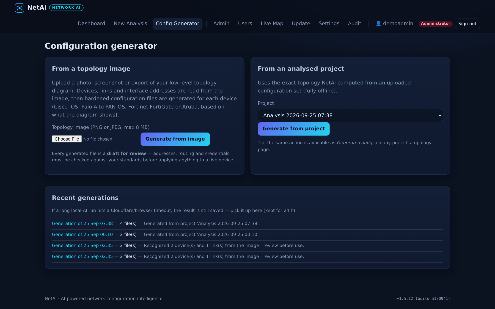
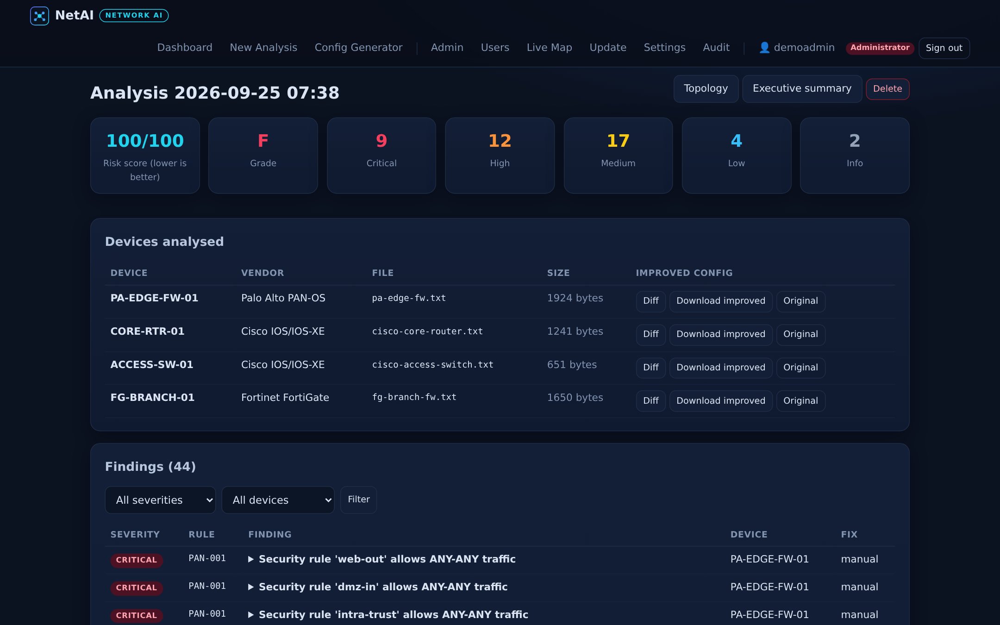
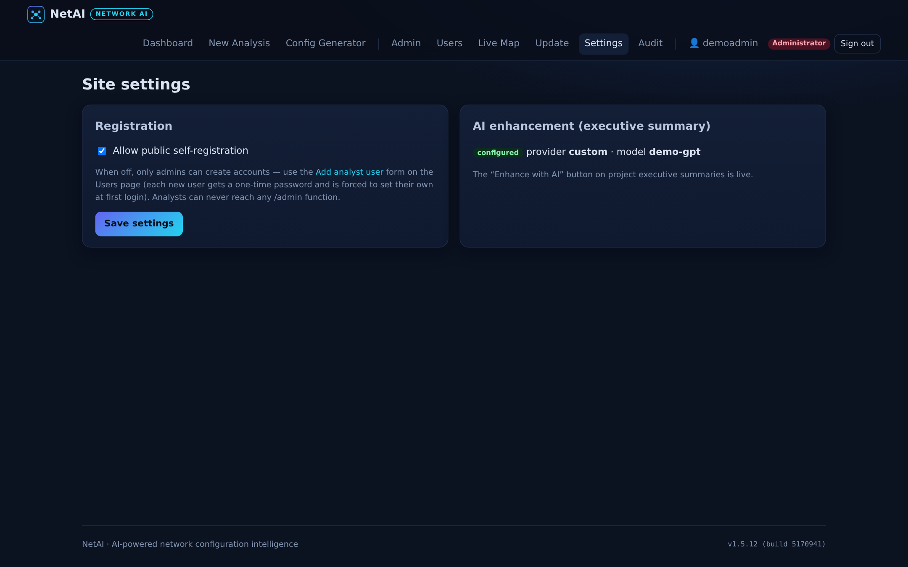
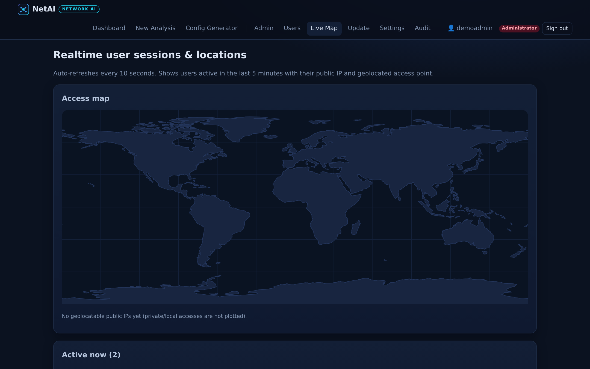
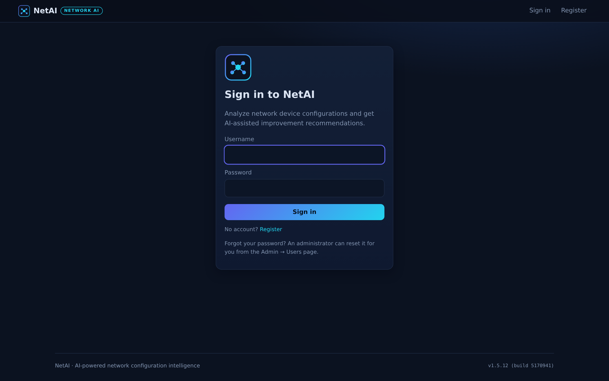

# NetAI — AI Network Configuration Intelligence

NetAI ingests network device configuration files (Palo Alto, Cisco, Fortinet, Aruba),
finds security and reliability weaknesses, **generates improved configurations**, produces an
**executive summary** of recommendations, and renders a **low-level network topology** from
the parsed interfaces, VLANs, subnets and routes.


## Screenshots

All screens below are captured from a running NetAI instance (dark theme, admin view).

<p align="center">
  
  <br><sub><b>Low-level topology</b> — auto-generated from parsed interfaces, subnets, VLANs and routes. Drag, zoom, hover for details, export to SVG.</sub>
</p>

| | |
|---|---|
|  |  |
| **Dashboard** — analyses, findings, risk score and grade at a glance. | **Executive summary** — risk narrative, device inventory, phased roadmap; optionally narrated by an LLM with one click. |
|  |  |
| **Generated configurations** — hardened baselines per device (PAN-OS set format shown), downloadable individually or as a ZIP. | **Config generator** — from a topology image (AI vision, fully local with Ollama) or from an analysed project (offline). |

<details>
<summary><strong>More screenshots</strong> — findings analysis, login, admin settings, realtime user map</summary>

| | |
|---|---|
|  |  |
| **Findings** — evidence lines, business impact and ready-to-paste remediation configs for every rule hit. | **Admin settings** — AI provider recipes (OpenAI, Anthropic, Gemini/Groq free tiers, fully-local Ollama) with copy-paste `.env` blocks. |
|  |  |
| **Live map** — active sessions geolocated in real time, recent login history. | **Sign-in** — one-time-setup admin bootstrap via a root-only setup key. |

</details>

## Features

**1. Configuration analysis (the AI engine)**
- Auto-detects vendor per file: **Palo Alto PAN-OS** (XML *and* set format), **Cisco
  IOS/IOS-XE**, **Fortinet FortiGate**, **Aruba AOS-CX / ArubaOS**.
- 50+ hardening rules derived from CIS benchmarks, vendor hardening guides and NIST 800-53
  control families: any/any firewall rules, Telnet, type-7 passwords, SNMP communities,
  management exposure, TLS versions, logging/NTP gaps, legacy services, and more.
- Every finding carries evidence lines, business impact, and a ready-to-paste
  **remediation config snippet**.
- **Config improvement:** downloadable improved configs (safe line transforms + appended
  remediation blocks) with an on-screen unified diff against the original.
- **Executive summary:** risk score (0-100) + grade, severity breakdown, top risks with
  plain-English business impact written for executives (per rule, e.g. what a firewall
  takeover means for the company), device inventory, and a phased remediation roadmap
  that **includes the actual configuration lines to apply** for each risk — printable to
  PDF, downloadable as Markdown. Optional **LLM narration** (OpenAI/Anthropic/compatible) via
  one click when an API key is configured — the engine works fully offline without it.
- **Low-level topology:** interactive SVG map (drag, zoom, tooltips, VLAN colour coding,
  export to SVG) built from parsed interfaces, IPs, VLANs, static/default routes — with
  internet/WAN clouds and L2 segments.

**2. Admin portal (`/admin`)**
- **One-time admin registration:** the installer generates a setup key (root-only file);
  `/setup` accepts it exactly once, then is permanently disabled.
- User statistics: totals, logins 24h/7d, projects, findings by severity, logins-per-day
  chart, top access countries.
- User management: **add analyst users** (auto-generated one-time password, forced change at
  first login), search, password reset, enable/disable, promote/demote, delete. Analysts get
  full analysis functionality and are blocked from every admin function (server-enforced).
- **AI integration status** panel with copy-paste setup instructions; the "Enhance with AI"
  button only appears once configured.
- **Realtime user map:** active sessions in the last 5 minutes with public IP and
  geolocated city/country, plotted on a world map, auto-refreshing every 10 s; plus recent
  login history.
- **Site update from GitHub:** compares the running build with the latest commit on your
  GitHub repo, lists recent commits, and runs `scripts/update.sh` (git pull + dependency
  install + service restart) through a root systemd one-shot unit authorized with a
  scoped polkit rule - no sudo, and the button is disabled while you are on the latest
  version.
- Settings (self-registration toggle) and a full audit log.

**3. Installer for Ubuntu Server**
- One command installs system deps, clones the repo, creates a venv, generates secrets,
  creates a hardened systemd service (dedicated no-login user, `NoNewPrivileges`,
  `ProtectSystem`), a minimal sudoers rule for updates only, and prints your one-time
  setup key.

## Quick start (Ubuntu Server 20.04/22.04/24.04)

```bash
sudo bash install.sh                      # clones mikeehendricks/NetAI -> /opt/netai, port 8000
# options: --port 8080 | --dir /srv/netai | --repo owner/repo | --branch main | --local | --with-nginx
```

Then open `http://<server-ip>:8000/setup`, paste the **setup key** printed by the installer
(also in `/opt/netai/instance/SETUP_KEY`, root-readable only), and create the admin
account. The setup page is burned permanently afterwards.

Manual/dev run:

```bash
pip3 install -r requirements.txt
python3 run.py                 # http://localhost:8000
```

## Uploading configs

Sign in → **New analysis** → select one or more config files (max 20 files, 25 MB each,
plain text). Try the samples in `demo_configs/` to see findings, improved configs, the
topology map and the executive summary immediately.

## Optional AI enhancement of the executive summary

Set any of these in `.env` and restart:

```ini
AI_PROVIDER=openai            # or anthropic, or custom (OpenAI-compatible)
OPENAI_API_KEY=sk-...
OPENAI_MODEL=gpt-4o-mini
# or
AI_PROVIDER=anthropic
ANTHROPIC_API_KEY=...
ANTHROPIC_MODEL=claude-sonnet-4-20250514
```

Without keys the deterministic engine produces the full summary — the LLM only polishes
the narrative and adds clearly-marked "AI observation" notes.

## Updating the site

Sign in as admin → **Update**. The page shows the running build vs the latest commit on
`GITHUB_REPO`/`GITHUB_BRANCH` (default `mikeehendricks/NetAI` @ `main`); *Install update*
is disabled while you are on the latest version. When clicked it starts
`netai-update.service` (root one-shot → `scripts/update.sh`: git fetch/reset, pip install,
service restart), which the `netai` service user may start via a polkit rule scoped to
exactly two units. Works even though the web app runs with `NoNewPrivileges=true`.

## Configuration reference (`.env`)

| Variable | Default | Meaning |
|---|---|---|
| `SECRET_KEY` | generated | Flask session signing key |
| `PORT` | 8000 | Listen port |
| `TRUST_PROXY` | 0 | Set 1 behind nginx/CDN to read real client IPs (X-Forwarded-*) |
| `HTTPS_ONLY` | 0 | Set 1 behind TLS: HSTS + Secure cookies |
| `ALLOW_SIGNUP` | 1 | Public self-registration (also toggleable in /admin) |
| `GITHUB_REPO` / `GITHUB_BRANCH` | mikeehendricks/NetAI / main | Update source |
| `GITHUB_TOKEN` | empty | Only needed for private repos |
| `AI_PROVIDER` + keys | empty | Optional LLM enhancement |
| `GEOIP_ENABLED` | 1 | Realtime location lookups (ip-api.com) |
| `MAX_UPLOAD_MB` | 25 | Per-file upload cap |

## Testing

```bash
python3 -m unittest tests.test_analysis            # engine unit tests
python3 tests/security_test.py <url>               # 40 black-box security checks
python3 tests/perf_test.py <url> [admin-password]  # latency benchmark
bandit -r app config.py run.py wsgi.py             # static security scan
```

See `docs/SECURITY_TEST_REPORT.md` for the full test report.

## Architecture

```
app/
├── analysis/          # vendor parsers + rule engines + topology + summary + AI layer
│   ├── cisco.py  paloalto.py  fortinet.py  aruba.py
│   ├── topology.py    # graph inference (subnets, VLANs, WAN clouds)
│   └── summary.py ai.py engine.py
├── auth.py admin.py main.py api.py security.py geo.py models.py
├── templates/         # server-rendered, CSP-safe (no inline JS)
└── static/            # self-contained CSS/JS (no CDNs)
scripts/update.sh      # git pull + pip install + systemctl restart
install.sh             # Ubuntu installer
```

## Security notes

- One-time setup key, CSRF tokens everywhere, login lockout + rate limiting, strict CSP,
  role-based access, audit logging, upload sandboxing, parameterized SQL, defusedxml.
- Files stay on your server. Uploaded configs are stored with 0600 permissions under
  `instance/uploads/` (excluded from git).
- **If you ever pasted a GitHub token into chat or tickets, revoke it** and create a new
  fine-grained token (Contents: read/write on the NetAI repo only).

## License

MIT
